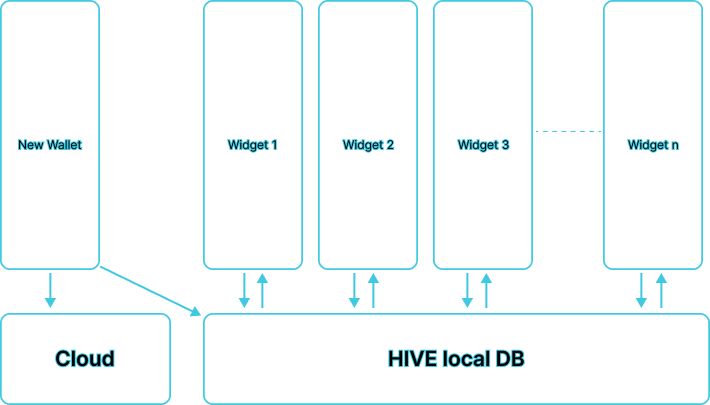

# Crypto Wallet App

## Overview
The **Crypto Wallet App** is a mobile application developed with Flutter that allows users to manage their cryptocurrency assets securely. The app supports Ethereum and TON networks, enabling users to create wallets, generate addresses, and perform transactions seamlessly. 

## Features
- **Multi-Currency Support**: Supports Ethereum and TON networks also USDT and USDC.
- **Wallet Generation**: Users can generate new wallets with secure mnemonic phrases.
- **Address Management**: Create and manage multiple cryptocurrency addresses.
- **Transaction Handling**: Send and receive cryptocurrencies.
- **Virtual Card Integration**: Users can create virtual credit cards for their transactions. (next feature)
- **User Authentication**: Secure user registration and login via Supabase.
- **Data Storage**: Secure storage of wallet information using Supabase.
- **Push Notifications**: Users receive notifications for transaction updates. (next feature)

## Getting Started

### Prerequisites
- Flutter SDK
- Dart SDK
- Supabase account
- tonutils 'package'
- web3dart 'package'
- Alchemy API access for Ethereum and TON blockchain interactions
- GetBlock.io API access for TON blockchain interactions

## Data structured
```bash
wallet : {
    “mnemonic”: [],
    “tokens”: {
        “ethereum”: {
            “address”: ......,
            “balance”:0.0,
             “privateKey”: ......,
        }
        “the-open-network”: {
            “address”: ......,
            “balance”:0.0,
             “privateKey”: ......,
        }
    }
}
```



### Installation
1. **Clone the repository**:
    ```bash
    git clone https://github.com/sissinou-moon/Crypto-wallet.git
    cd Crypto-wallet
    ```

2. **Install dependencies**:
    ```bash
    flutter pub get
    ```

3. **Set up environment variables**: Create a `.env` file in the root directory and add the following:
    ```plaintext
    SUPABASE_URL=your_supabase_url
    SUPABASE_ANON_KEY=your_supabase_anon_key
    MARQETA_APPLICATION_TOKEN=your_marqeta_application_token
    MARQETA_ADMIN_TOKEN=your_marqeta_admin_token
    ALCHMEY_API_KEY=your_alchemy_api_key
    ```

4. **Run the app**:
    ```bash
    flutter run
    ```

## API Integration

### Supabase
The app uses Supabase for user authentication and data storage:
- **User Authentication**: Register and login users securely.
- **Database Storage**: Store wallet information, transaction history, and user data.

**Documentation**: [Supabase Docs](https://supabase.io/docs)

### Alchemy | GetBlock.io
Alchemy is used to interact with Ethereum blockchains and GetBlock.io for TON blockchains:
- **Wallet Operations**: Send and receive tokens.
- **Get Transaction History**: Retrieve past transactions.

## Contributing
Contributions are welcome! Please follow these steps:
1. Fork the repository.
2. Create a new branch: `git checkout -b feature/YourFeature`
3. Make your changes and commit them: `git commit -m "Add new feature"`
4. Push to the branch: `git push origin feature/YourFeature`
5. Create a Pull Request.

## License
This project is licensed under the MIT License - see the [LICENSE](LICENSE) file for details.

## Acknowledgments
- Thanks to [Flutter](https://flutter.dev) for the amazing framework.
- Thanks to [Supabase](https://supabase.io) for the backend services.
- Thanks to [Alchemy](https://getblock.io) for the blockchain API services.

